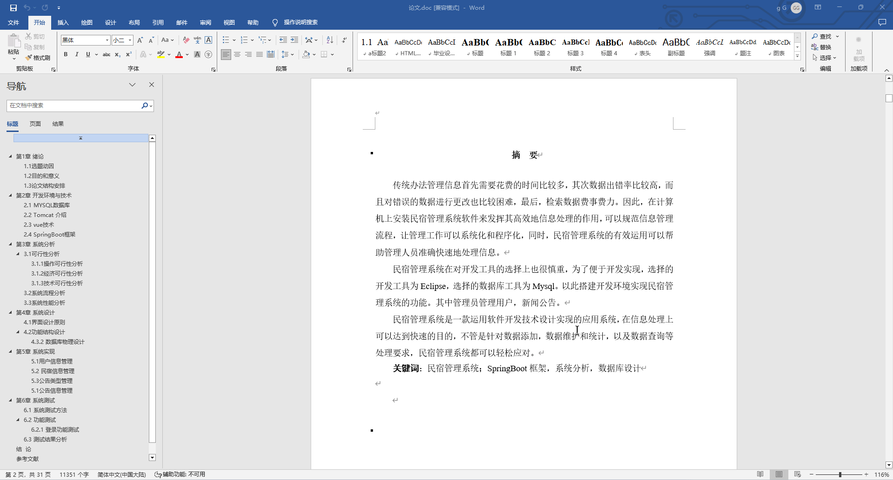
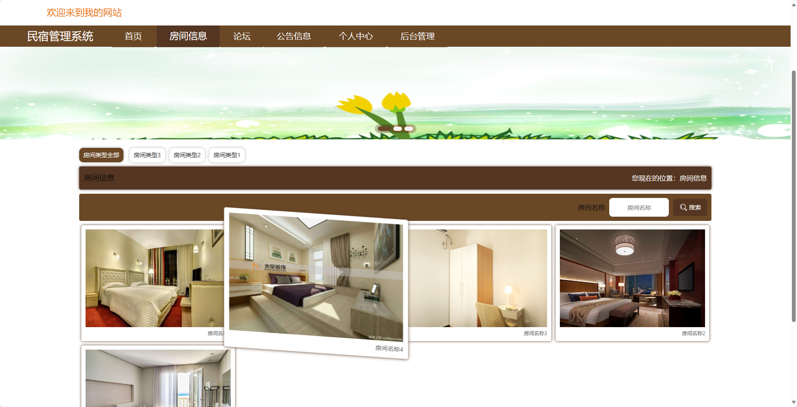
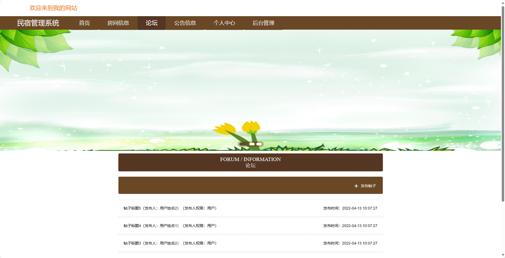
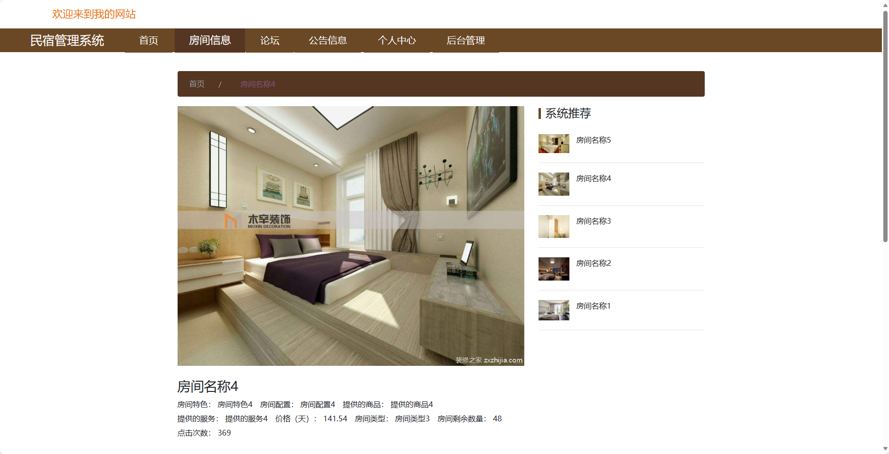
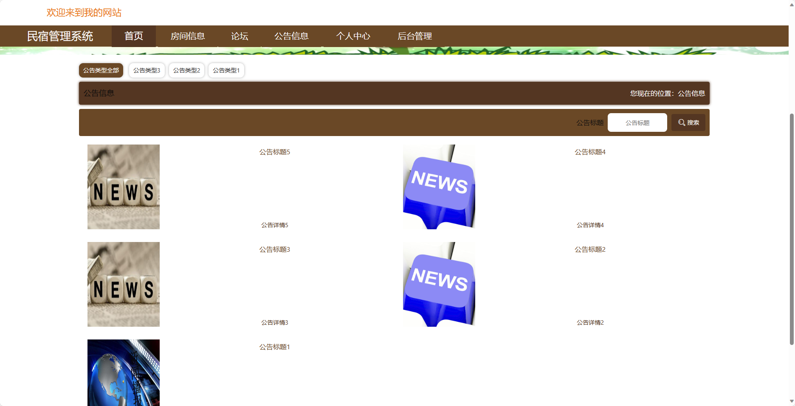
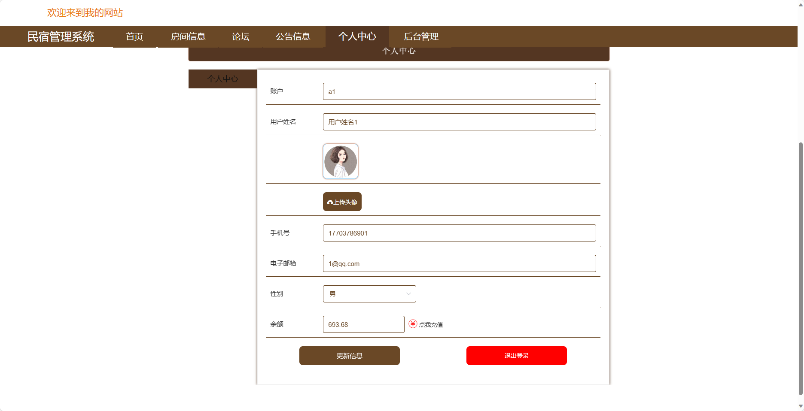
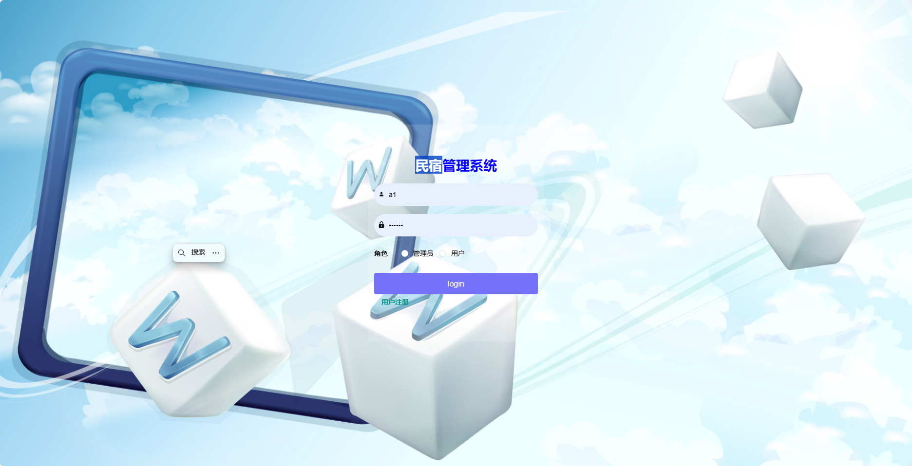
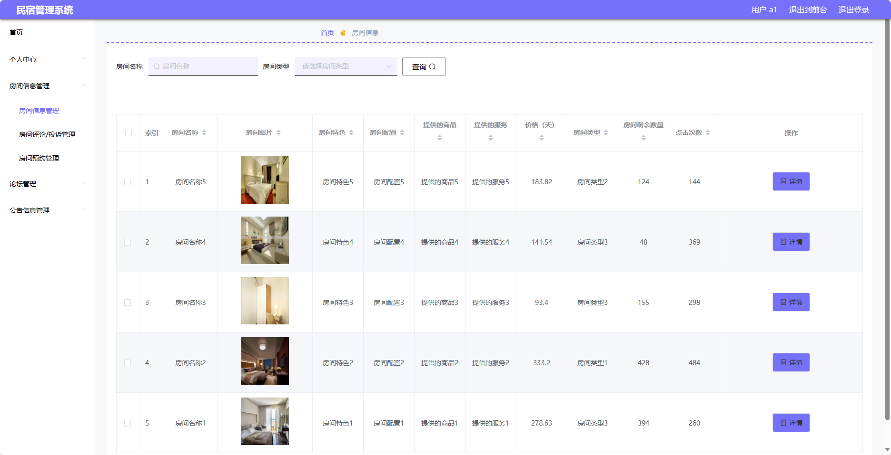
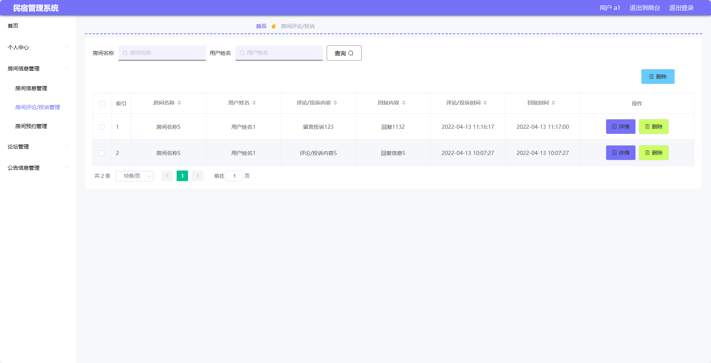
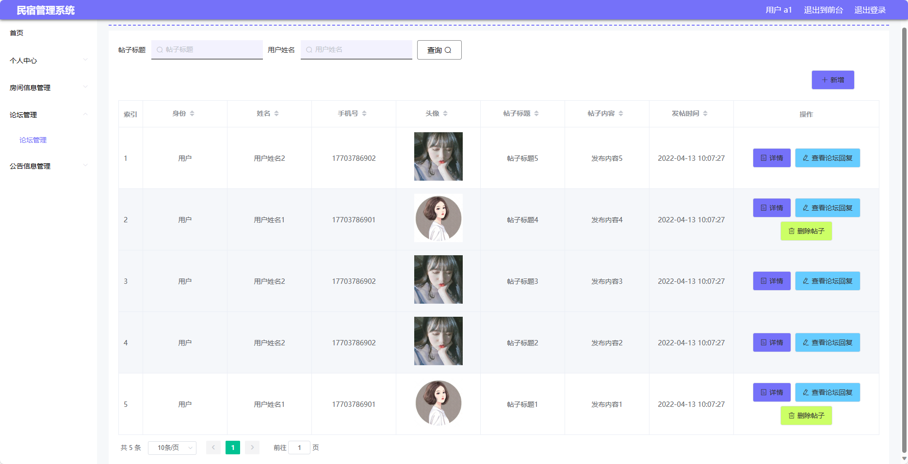

## 基于SpringBoot的民宿管理系统(程序+报告)

###  获取sql数据库文件: 从戎源码网 (https://armycodes.com/) QQ: 386869957 QQ群: 377586148
###  所有系统地址: (https://github.com/YuLin-Coder/AllProjectCatalog) 
###  所有项目以及源代码本人均调试运行无问题 可支持远程安装部署调试、定制修改、代码讲解

## 项目介绍
基于SpringBoot的民宿管理系统，系统包含两种角色：管理员、用户,系统分为前台和后台两大模块，主要功能如下。

### 【管理员】:
1. 个人中心：管理个人信息。
2. 管理员管理：管理其他管理员账号，包括添加、编辑、删除管理员等操作。
3. 基础数据管理：管理基础数据，包括地区信息、设施信息等。
4. 房间信息管理：管理房间信息，包括添加、编辑、删除房间信息。
5. 论坛管理：对论坛帖子进行管理，包括查看、删除、置顶等操作。
6. 公告信息管理：管理公告信息，包括添加、编辑、删除公告等操作。
7. 用户管理：管理注册用户信息，包括查看、冻结、删除用户等操作。
8. 轮播图信息：管理首页轮播图信息，包括添加、编辑、删除轮播图等操作。

### 【用户】:
1. 个人中心：管理个人信息。
2. 房间信息管理：管理房间信息，包括添加、编辑、删除房间信息。
3. 论坛管理：管理论坛帖子，包括查看、删除、置顶等操作。
4. 公告信息管理：管理公告信息，包括添加、编辑、删除公告等操作。

### 【前台】:
1. 首页：展示民宿的相关信息和推荐房源。
2. 房间信息：用户可以查看房间的详细信息。
3. 论坛：用户可以在论坛上进行讨论和交流。
4. 公告信息：展示民宿的公告信息，包括优惠活动、重要通知等。
5. 个人中心：用户可以管理个人信息、订单记录、收藏房源等。

## 项目技术
- 编程语言：Java
- 数据库：MySQL
- 项目管理工具：Maven
- 前端技术：HTML、CSS、JavaScript、Jquery、Vue
- 后端技术：Spring、SpringMVC、MyBatis

## 运行环境
- JDK版本：JDK1.8及以上
- 开发工具：IDEA、Ecplise、Myecplise都可以
- 数据库: MySQL5.7及以上
- Maven：maven3.0及以上
- Node：14.14.0及以上

## 运行截图

